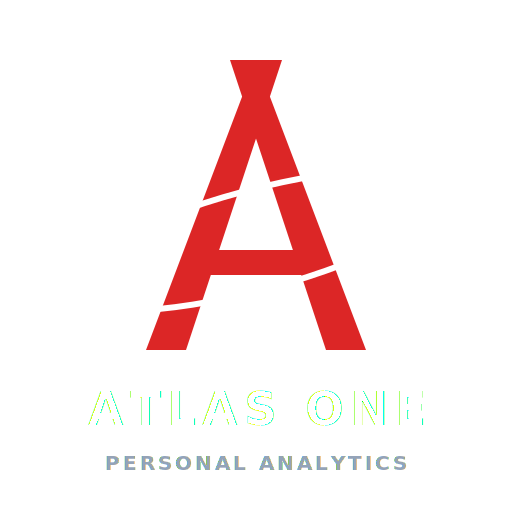

<p align="center">
  
</p>

# Atlas One

> **Personal Analytics & Predictive Insights**

Atlas One is an intelligent, premium personal analytics platform that transforms user productivity logs, health markers, study plans, financial records, habits, and journals into actionable predictions. Built using React, TypeScript, FastAPI, and scikit-learn, it acts as a private, high-fidelity data intelligence hub.

---

## 🚀 Key Modules & Features

### 📊 Personal Analytics
*   **Daily Metric Hub**: Aggregated indices for productivity, learning consistency, fitness routines, and diet calorie levels.
*   **Time-Series Insights**: Clean charts showing weekly progress trends, weight forecasts, and study distributions.
*   **Balance Matrix**: Custom polar radar charts mapping discipline metrics dynamically.

### 🧠 Machine Learning Engine
Atlas One runs on-the-fly model training and statistical inference directly against user database records:
1.  **Productivity Predictor (Random Forest Regressor)**: Models daily productivity indices and completion bounds using historical sleep duration, calorie counts, and study distributions.
2.  **Goal Achievement Probabilities (Logistic Regression)**: Evaluates deadlines, progress metrics, and recent discipline scores to calculate goal completion odds.
3.  **Reflective NLP Analysis (VADER)**: Evaluates mood indexes and compound sentiments inside user text journals.
4.  **Anomaly Detection (Isolation Forest)**: Flags statistical outliers in sleep duration, study hours, or diet spikes.
5.  **Seasonal Trend Forecasters (Linear/Polynomial)**: Computes 7-day weight regressions and study targets.

### 🎙️ AI Voice Center & Advisor
*   **Speech Commands**: Native browser speech recognition to navigate boards and log habits.
*   **Morning AI Briefing**: Conversational daily briefings prepared by the AI Coach.
*   **Voice Journals**: Record diary audio and get automatic text transcripts with VADER mood analysis.

---

## 🛠️ Technology Stack & Architecture

### Frontend
*   **React** (v18) + **TypeScript**
*   **Vite** (Build Tool)
*   **TailwindCSS** (Vanilla CSS tokens in `index.css`)
*   **Framer Motion** (Spring transitions and layout animations)
*   **Recharts** (Visual analytics)

### Backend
*   **FastAPI** (Python framework)
*   **SQLAlchemy** (ORM)
*   **Uvicorn** (ASGI server)
*   **PostgreSQL** (Production database) / **SQLite** (Local testing)
*   **scikit-learn**, **pandas**, **numpy**, **vaderSentiment** (ML/NLP suite)

```
                       ┌──────────────────────────────┐
                       │      Vite React Client       │
                       └──────────────┬───────────────┘
                                      │ REST API (JSON)
                                      ▼
                       ┌──────────────────────────────┐
                       │      FastAPI App Engine      │
                       └──────┬────────────────┬──────┘
                              │                │
              SQLAlchemy ORM  │                │  Scikit-Learn / VADER
                              ▼                ▼
                       ┌──────────────┐ ┌──────────────┐
                       │  Postgres /  │ │  ML Pipeline │
                       │    SQLite    │ │  & Models    │
                       └──────────────┘ └──────────────┘
```

---

## 📂 Folder Structure

```
├── backend/
│   ├── app/
│   │   ├── ml/                  # Machine learning engines & models
│   │   │   ├── prediction/      # RandomForest and Logistic models
│   │   │   ├── forecasting/     # Linear regression models
│   │   │   ├── sentiment/       # VADER reflection analyzer
│   │   │   └── scoring/         # Wellness index scoring
│   │   ├── models/              # SQLAlchemy database tables
│   │   ├── routers/             # FastAPI REST endpoints
│   │   ├── utils/               # Scheduler, cloud backup, and email helpers
│   │   ├── config.py            # Environment configurations
│   │   └── main.py              # Application entry point
│   ├── requirements.txt
│   └── seed.py                  # Database mock seed generator
├── frontend/
│   ├── src/
│   │   ├── components/          # Reusable UI layouts & components
│   │   ├── pages/               # Page templates (Dashboard, AI Coach, Voice)
│   │   ├── store/               # Zustand authorization store
│   │   ├── hooks/               # React Query hooks
│   │   └── index.css            # Styling tokens system
│   ├── package.json
│   └── vite.config.ts
└── docker-compose.yml
```

---

## 💻 Local Installation & Setup

### 1. Database & Backend Setup
1.  Navigate to the backend directory:
    ```bash
    cd backend
    ```
2.  Create a virtual environment and activate it:
    ```bash
    python -m venv venv
    # Windows
    .\venv\Scripts\activate
    # macOS/Linux
    source venv/bin/activate
    ```
3.  Install dependencies:
    ```bash
    pip install -r requirements.txt
    ```
4.  Seed the local database:
    ```bash
    $env:DATABASE_URL="sqlite:///atlas_one.db"
    python -m app.seed
    ```
5.  Launch the development server:
    ```bash
    python -m uvicorn app.main:app --reload
    ```

### 2. Frontend Setup
1.  Navigate to the frontend directory:
    ```bash
    cd ../frontend
    ```
2.  Install dependencies:
    ```bash
    npm install
    ```
3.  Run the application locally:
    ```bash
    npm run dev
    ```

---

## 📈 Deployment
*   **Frontend**: Deployed to Vercel (static single-page application).
*   **Backend**: Deployed to Render (FastAPI Docker container) with PostgreSQL.
