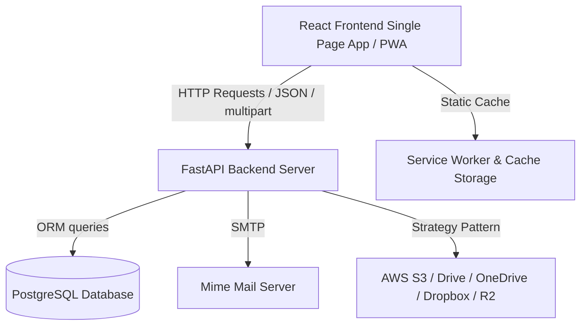

# ⚡ BHANOVA – Personal Growth Platform

> A premium personal growth platform for tracking Data Science study, LeetCode/DSA practice, fitness, diet/nutrition, habits, sleep, reading, finance budgets, mindful journals, academics, and placement applications, complete with a built-in AI Voice Assistant, speech-to-text voice journals, body progress timelines, smartwatch adapters, Google Calendar sync engines, SMTP email reminder queues, family sharing dashboards, local backup pipelines, and a gameful XP/Level leveling mechanic.


---

## 🚀 Quick Start (Local Run)

A PostgreSQL database is required. Provide the database connection URL via the DATABASE_URL environment variable.

### 1. Run the Backend Server
```bash
cd backend

# Create virtual environment & activate
python -m venv venv
venv\Scripts\activate  # On Windows
# source venv/bin/activate  # On Linux/macOS

# Install dependencies
pip install -r requirements.txt

# Run the backend (database initializes and seeds automatically on start)
uvicorn app.main:app --reload --port 8000
```
* **API Documentation (Swagger UI)**: [http://127.0.0.1:8000/docs](http://127.0.0.1:8000/docs)

### 2. Run the Frontend Client
```bash
cd frontend
npm install
npm run dev
```
* **Client App**: [http://localhost:5173/](http://localhost:5173/)

**Default seeded credentials:**
* **Email**: `bhanu@lifeos.app`
* **Password**: `lifeos2026`

---

## 🏛️ System Architecture



* **Frontend SPA**: React 19, Vite, TailwindCSS v4, Recharts, Zustand, TanStack Query, and Framer Motion for premium UI transitions.
* **Service Worker**: Cache-first asset caching handles offline capability and links to PWA web manifest.
* **Backend API**: FastAPI serving modular router endpoints for users, habits, study plans, DSA problem tracking, goals, fitness diaries, and system backups.
* **Database**: PostgreSQL instance managed via SQLAlchemy 2.0 ORM, featuring auto-seeding on fresh start.

---

## 🗄️ Database Schema & ORM Relationships

The database structure contains linked tables mapping personal logging metrics to the `users` credentials.

```mermaid
erDiagram
    users ||--o{ habits : "has habits"
    users ||--o{ study_topics : "studies"
    users ||--o{ dsa_topics : "DSA topics"
    users ||--o{ fitness_logs : "workout sessions"
    users ||--o{ food_logs : "calorie journals"
    users ||--o{ sleep_logs : "sleep cycles"
    users ||--o{ books : "library entries"
    users ||--o{ goals : "personal goals"
    users ||--o{ planner_tasks : "tasks list"
    users ||--o{ journal_entries : "daily journals"
    users ||--o{ finance_logs : "transaction ledgers"
    users ||--o{ job_applications : "jobs pipeline"
    users ||--o{ masters_preps : "exam scores"
    users ||--o{ university_shortlists : "university list"
    users ||--o{ knowledge_items : "vault items"
    users ||--o{ voice_journals : "audio logs"
    users ||--o{ progress_photos : "timeline pictures"
    users ||--o{ smartwatch_syncs : "wearables links"
    users ||--o{ google_calendar_credentials : "oauth tokens"
    users ||--o{ group_memberships : "joined groups"
    family_groups ||--o{ group_memberships : "members roster"
    family_groups ||--o{ group_invitations : "invites roster"
    family_groups ||--o{ shared_goals : "shared goals"
```



---

## ⚙️ Env Configuration & Deployment Secrets

All credentials should be added to the `.env` file in the root of the `backend` folder.

### 1. Google OAuth & Calendar Integration:
Used to synchronize calendar events.
```env
GOOGLE_CLIENT_ID=your_google_client_id_from_cloud_console
GOOGLE_CLIENT_SECRET=your_google_client_secret_from_cloud_console
```

### 2. Email Notifications (SMTP Server):
Used to dispatch daily briefings, weekly reviews, and habit alerts.
```env
LIFEOS_SMTP_HOST=smtp.gmail.com
LIFEOS_SMTP_PORT=587
LIFEOS_SMTP_USER=your_gmail_address@gmail.com
LIFEOS_SMTP_PASSWORD=your_gmail_app_password
LIFEOS_SENDER_EMAIL=your_verified_sender_email@gmail.com
```

### 3. Smartwatch Integrations:
Used to synchronize steps/calories/heart rates.
```env
GOOGLE_FIT_CLIENT_ID=your_google_fit_id
FITBIT_CLIENT_ID=your_fitbit_id
GARMIN_CONSUMER_KEY=your_garmin_key
```

### 4. Cloud Backup (AWS S3 / R2 Bucket):
Used to upload encrypted JSON archives.
```env
AWS_ACCESS_KEY_ID=your_aws_s3_key_id
AWS_SECRET_ACCESS_KEY=your_aws_s3_secret_key
AWS_BUCKET_NAME=your_s3_bucket_name
```
If credentials are not present, third-party features gracefully degrade to local mock adapters to protect system stability.
